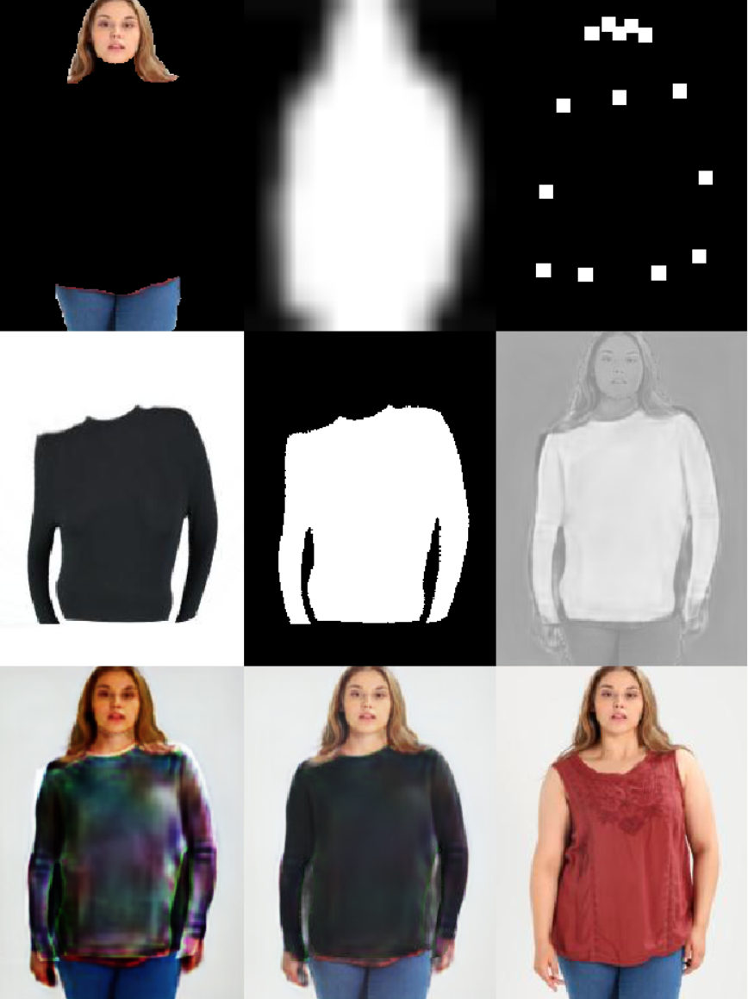
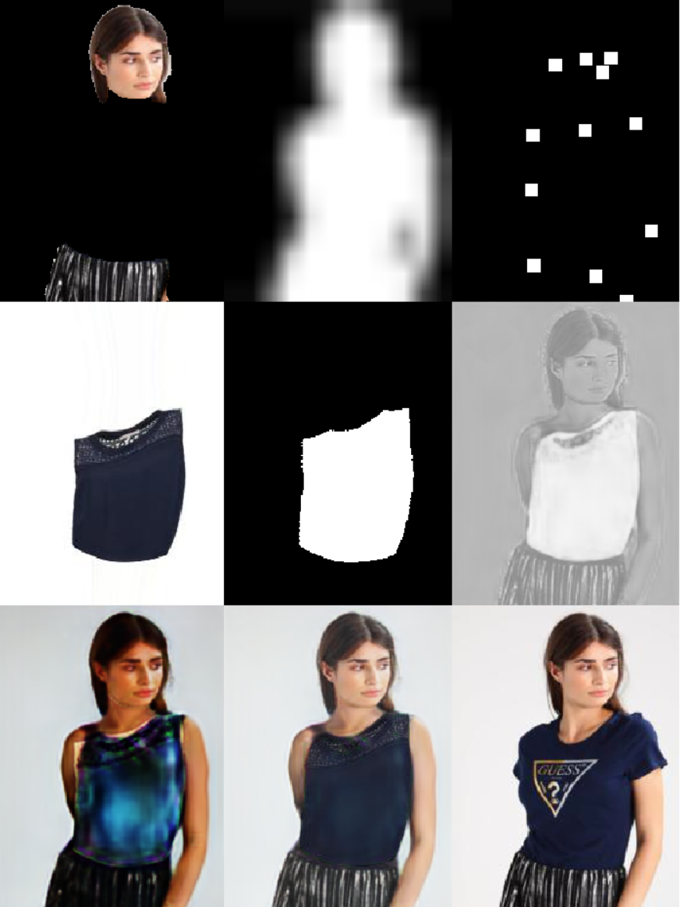
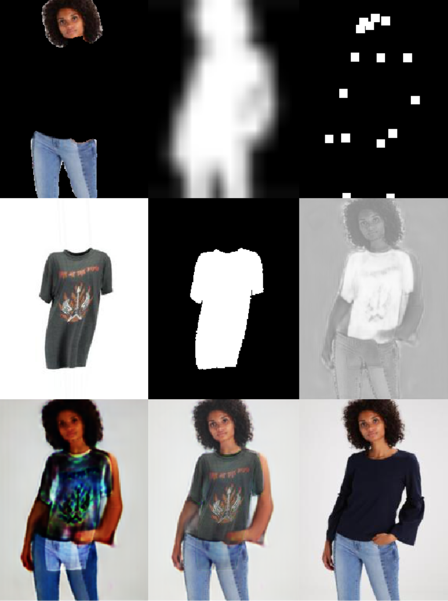
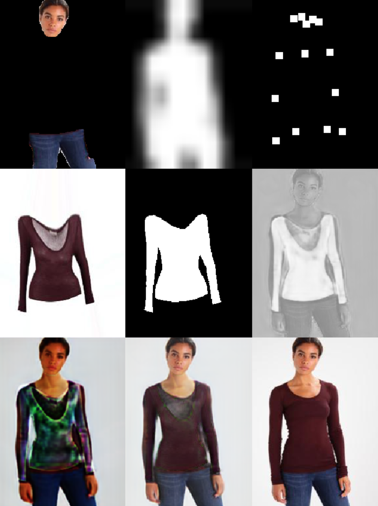

## Resleeve Assignment
Virtual Try On using Generative Adversarial Networks (GANs)


---

*Read some images and display them.*
- Implemented in display() function in ./src/data/cp_dataset.py

``` $ python src/data/cp_dataset.py  --dataroot 'my/data/root/' ```

---

*Have some code for the pre-processing pipeline*
- Implemented in CPDataset class in src/data/cp_dataset.py
- Will preprocess GMM or TOM inputs.

``` CPDataset() ```

---

*Load a pre-trained network* 
- ./src/models/predict_model.py will load the GMM or TOM networks from ./models/cp-vton-plus
- load_checkpoint() in ./src/models/networks.py does the job.

``` load_checkpoint(model, opt.checkpoint) ```

---

*Have some code to make predictions*
- ./src/models/predict_model.py generates predictions from GMM and TOM in test_gmm() and test_tom().
- The warped clothes (GMM outputs) are stored in ./data/external/test and ./data/results/GMM/test
- The final transformed images are in ./data/results/TOM/test/try-on
- The tensorboard outputs are stored in ./tensorboard

``` $ python src/models/predict_model.py --dataroot 'my/data/root/' ```

---

*Select a metric and evaluate the pre-trained network on the test dataset*
- ./src/data/evaluate_dataset.py creates EvaluateDataset and EvaluateDataLoader classes 
- These classes load the original and final transformed image from ./data/results/TOM/test
- The average Structural Similarity Index Measure SSIM is calculated and printed in the main function.
- The test images have a SSIM of 0.7298

``` $ python evaluate_dataset.py --dataroot 'my/data/root/'```

**Sample output 1**
    
**Sample output 2**
    
**Sample output 3**
    
**Sample output 4**
    


--------

<p><small>Project based on the <a target="_blank" href="https://drivendata.github.io/cookiecutter-data-science/">cookiecutter data science project template</a>. #cookiecutterdatascience</small></p>
